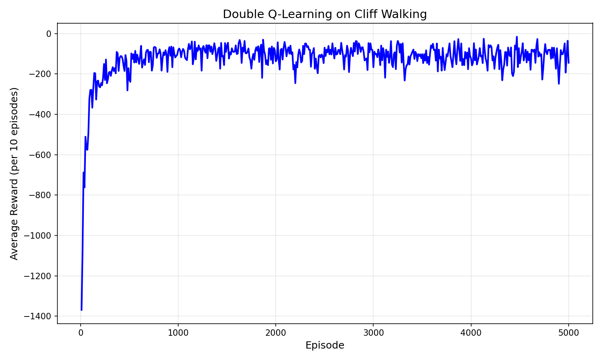

# Double Q-learning cliff walking

A Python implementation of Double Q-learning on Gymnasium's Cliff Walking environment.

The project trains two separate Q-tables, uses them together for action selection, and updates one table at a time to reduce the overestimation that can show up in standard Q-learning. The included run trains for 5,000 episodes and saves both a learning curve and a greedy episode summary.

## What it does

- Trains a Double Q-learning agent on `CliffWalking-v1`.
- Uses epsilon-greedy exploration during training.
- Maintains two Q-tables and averages them into a final action-value table.
- Saves a learning curve showing average reward every 10 episodes.
- Exports the final greedy episode with state, action, and reward steps.

## Learning curve

The curve below shows average reward per 10 episodes from a 5,000-episode training run. Early episodes are noisy because the agent is still exploring. After training, the rewards settle closer to the safer route through the grid.



## Project structure

```text
.
├── README.md
├── LICENSE
├── requirements.txt
├── assets/
│   └── learning_curve.png
├── examples/
│   └── optimal_episode.txt
├── src/
│   ├── double_q_agent.py
│   ├── train.py
│   └── visualize_policy.py
└── tests/
    └── test_double_q_agent.py
```

## How to run it

Create a virtual environment and install dependencies:

```bash
python -m venv .venv
.venv\Scripts\activate
pip install -r requirements.txt
```

Train the agent and regenerate the plot:

```bash
python -m src.train --episodes 5000
```

Run tests:

```bash
python -m unittest discover -s tests -v
```

Visualize a greedy run in Gymnasium's human render mode:

```bash
python -m src.visualize_policy --episodes 5000
```

## Example greedy episode

The saved run reaches the goal in 13 steps by moving up once, moving right across the safe row, and then moving down into the goal.

```text
Step 1: s=36, a=0 (UP), r=-1
Step 2: s=24, a=1 (RIGHT), r=-1
...
Step 13: s=35, a=2 (DOWN), r=-1

Total steps: 13
Total return (discounted): -11.55
Goal reached: True
```

## Key files

- `src/double_q_agent.py`: contains the Double Q-learning agent and action-value table logic.
- `src/train.py`: trains the agent, saves the learning curve, and writes the greedy episode summary.
- `src/visualize_policy.py`: trains the agent and replays the greedy policy with Gymnasium rendering.
- `assets/learning_curve.png`: learning curve from the included 5,000-episode run.

## Reference

This project uses Gymnasium's `CliffWalking-v1` environment from the toy text suite.
